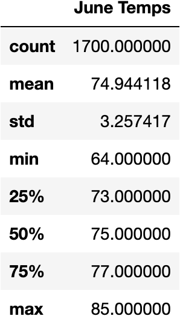

# Surfsup_challenge

## Overview of the Analysis 

### June weather Summary 
Looking at the temperature in Oahu, Hawaii during the month of June are around 74.9 degrees 

### December Weather Summary 
Looking at the temperature in Oahu, Hawaii during the month of June are around 71 degrees 

## Summary

Looks like the temperature in Hawaii through out the year stay within a couple of degrees and does not fluctuate greatly. 